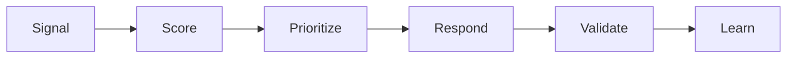

# Framework Overview

## What This Repository Does

This repository provides a practical model for predicting reliability issues before they turn into serious operational events.
It gives teams a structured way to turn signals into action.
The framework is designed to reduce alert noise and improve the quality of operational decisions.

## Predictive Flow

## What It Covers

- anomaly detection
- predictive alerting
- risk scoring
- operational intelligence
- self-healing concepts
- review workflows

## Who Uses It

- SRE teams
- platform engineers
- reliability leaders
- observability teams
- operations leaders

## What Good Looks Like

- alerts are tied to meaningful patterns
- risk can be ranked before incidents grow
- operational signals are reviewed consistently
- model outputs are validated against real events
- false positives are tracked and reduced over time

## How To Read It

Start with the strategy page, then move into the scoring and alerting models.
That sequence keeps the discussion focused on decisions first and outputs second.

## Result

When the framework is used well, teams spend less time sorting noise and more time acting on the signals that matter.

## Practical Use

Use this framework when you want an early-warning system that is still grounded in operational reality.

## Outputs

- predictive reliability playbook
- risk model
- alerting model
- review templates
- dashboard views

## Predictive Layers

| Layer | Question | Artifact |
| --- | --- | --- |
| Signal | What changed? | Anomaly detection |
| Score | How risky is it? | Reliability risk model |
| Decision | What should happen now? | Predictive alerting model |
| Response | Who acts? | Operational health review |
| Learning | What improves next? | Research roadmap |

## Decision Rule

If a model output does not improve action quality, it should not become a first-class operational signal.
